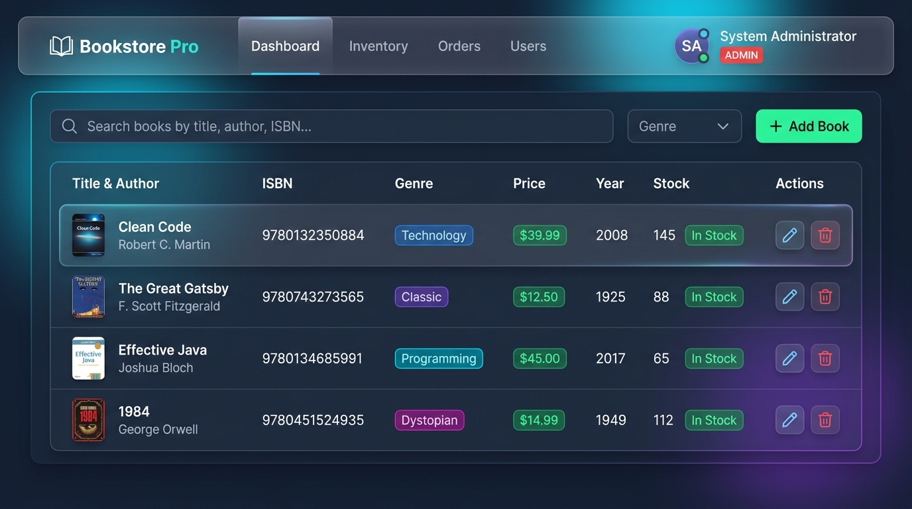
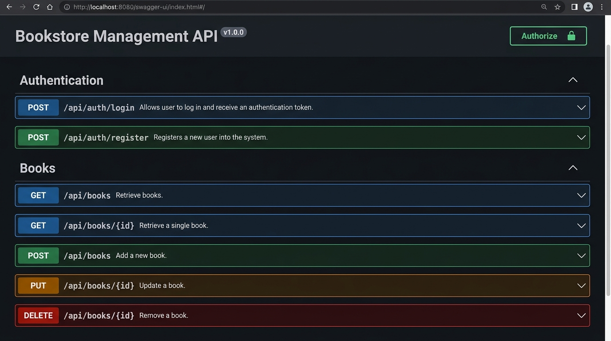
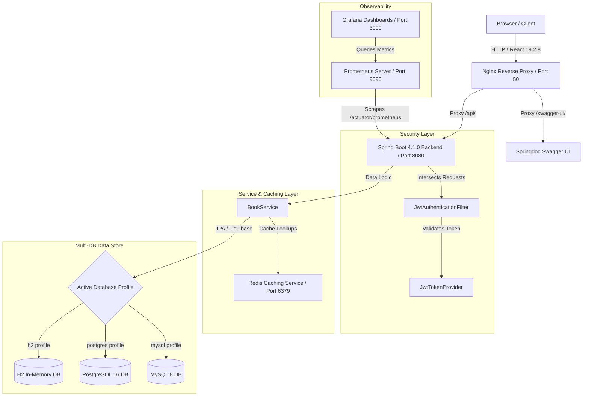
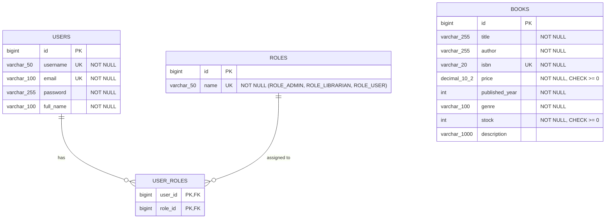
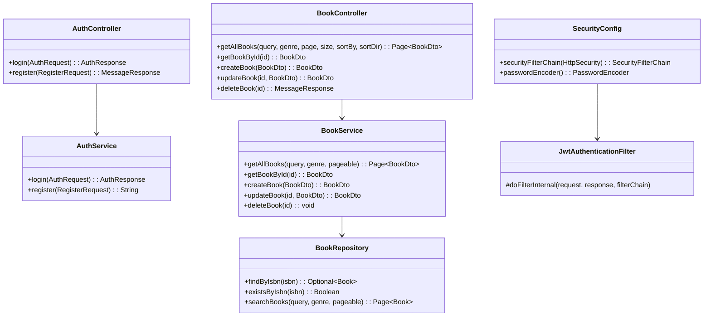
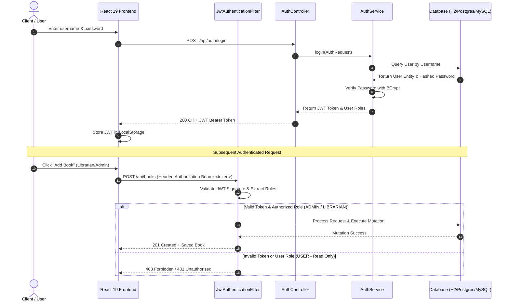
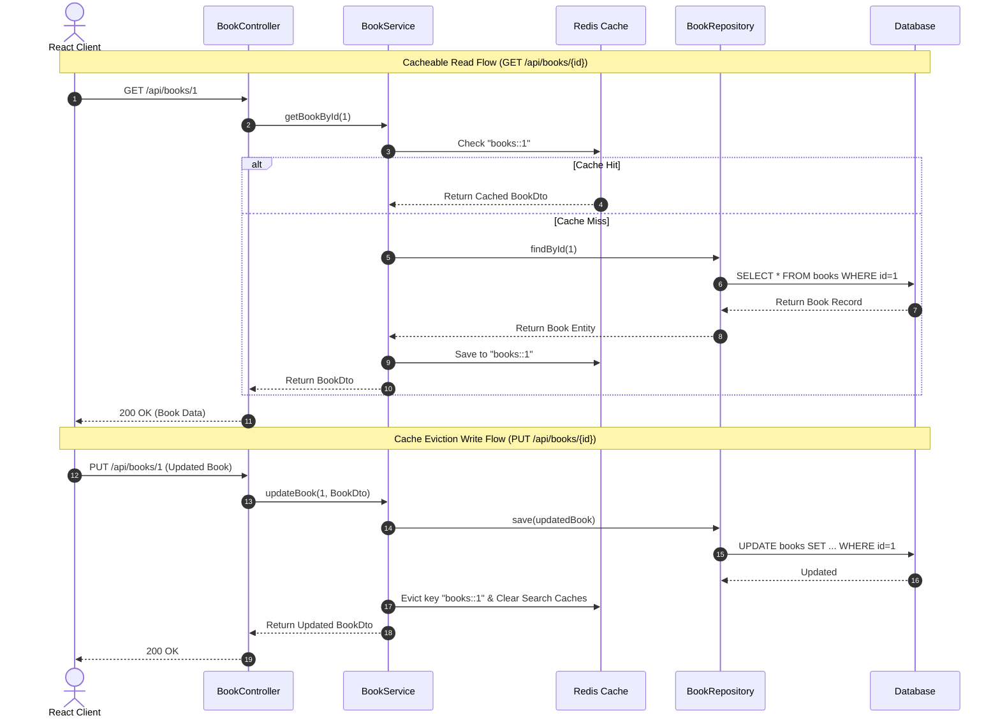

# Enterprise Bookstore Application

A full-stack, multi-environment Bookstore Inventory Management System built with **Spring Boot 4.1.0 (Java 25)**, **React 19.2.8**, **Liquibase**, **Redis Caching**, **Prometheus & Grafana**, and **Docker**.

GitHub Repository: [https://github.com/syskantechnosoft/bookstore](https://github.com/syskantechnosoft/bookstore)

---

## Application Screenshots

### 1. Bookstore Pro React UI Dashboard


### 2. Swagger UI OpenAPI Documentation


---

## Core Features & Multi-Role RBAC

- **Role-Based Access Control (RBAC)**:
  - `ROLE_ADMIN`: Full administrative permissions (CRUD on Books, Roles, and Users).
  - `ROLE_LIBRARIAN`: Full write, update, and delete permissions on Book inventory.
  - `ROLE_USER`: Read-only access to search and view book records.
- **Triple-Layer Input Validation**:
  - **Client-Side**: Real-time React form validation (ISBN format matching, positive numbers for price/stock, required fields).
  - **Server-Side**: Jakarta Validation `@Valid` DTO annotations handled by a global `@RestControllerAdvice` returning HTTP 400 validation error maps.
  - **Database-Side**: Liquibase DDL constraints (`NOT NULL`, `UNIQUE isbn`, `CHECK (price >= 0)`, `CHECK (stock >= 0)`).
- **Multi-Database Support & Spring Profiles**:
  - `h2`: In-memory database with Spring `simple` ConcurrentMap cache (`spring.profiles.active=h2`).
  - `postgres`: Production-grade PostgreSQL database container (`spring.profiles.active=postgres`).
  - `mysql`: Production-grade MySQL database container (`spring.profiles.active=mysql`).
- **Liquibase Database Migrations**:
  - Automatically provisions tables and populates **100 sample book records** across 10 genres.
- **Redis Caching**: High-performance `@Cacheable` and `@CacheEvict` annotations for book catalog lookups.
- **Observability**: Prometheus metrics scraped from `/actuator/prometheus` and visualized via pre-configured Grafana dashboards.

---

## Demo Credentials

| Role | Username | Password | Rights |
| :--- | :--- | :--- | :--- |
| **Admin** | `admin` | `Admin@123` | Full Read / Write / Update / Delete |
| **Librarian** | `librarian` | `Librarian@123` | Write / Update / Delete Books |
| **User** | `user` | `User@123` | Read-only Book Catalogue |

---

## UML Diagrams

### 1. System Architecture Diagram (C4 Container View)



---

### 2. Entity Relationship (ER) Diagram



---

### 3. Component & Class Diagram



---

### 4. JWT Authentication & RBAC Authorization Sequence Diagram



---

### 5. Book CRUD Operations & Redis Caching Sequence Diagram



---

## Free Cloud Deployment Options & GitHub Actions Setup

You can easily deploy this application to **free cloud hosting platforms** using Docker containers and GitHub Actions.

### Option 1: Render.com (Recommended Free Cloud Hosting)

Render provides free hosting for Docker Web Services, Managed PostgreSQL, and Redis.

#### 1. Setup Render Account & Blueprint:
1. Sign up for a free account at [Render.com](https://render.com).
2. Go to **Dashboard** -> **New** -> **Blueprint**.
3. Connect your GitHub repository `https://github.com/syskantechnosoft/bookstore`.
4. Render automatically detects `render.yaml` in your repository and provisions:
   - **PostgreSQL Database** (`bookstore-postgres-db` - Free)
   - **Redis Cache** (`bookstore-redis-cache` - Free)
   - **Spring Boot Backend** (`bookstore-backend-api` - Free)
   - **React Frontend** (`bookstore-frontend-ui` - Free)

#### 2. Automated CD via GitHub Actions:
1. In your Render Dashboard, navigate to your Web Services and copy their **Deploy Hook URLs**.
2. Go to your GitHub Repository -> **Settings** -> **Secrets and variables** -> **Actions**.
3. Add the secret keys:
   - `RENDER_BACKEND_DEPLOY_HOOK`: `<Your Render Backend Deploy Hook URL>`
   - `RENDER_FRONTEND_DEPLOY_HOOK`: `<Your Render Frontend Deploy Hook URL>`
4. Every push to `main` automatically triggers the `.github/workflows/deploy-render.yml` pipeline!

---

### Option 2: Koyeb (Alternative Free Container Platform)

Koyeb offers free web service micro-instances for Docker apps.

1. Create a free account at [Koyeb.com](https://koyeb.com).
2. Create a service linking to your GitHub repository `syskantechnosoft/bookstore`.
3. Set the builder type to **Dockerfile**, using `./backend/Dockerfile` for API and `./frontend/Dockerfile` for UI.

---

## Local Development & Testing

### Run Backend Unit & Integration Tests:
```bash
cd backend
mvn clean test "-Dspring.profiles.active=h2"
```

### Run Multi-Container Stack via Docker Compose:
```bash
docker-compose up --build
```
- **React Frontend**: `http://localhost`
- **Spring Boot API**: `http://localhost:8080`
- **Swagger UI**: `http://localhost:8080/swagger-ui.html`
- **Prometheus**: `http://localhost:9090`
- **Grafana**: `http://localhost:3000` (User: `admin`, Pass: `admin`)
